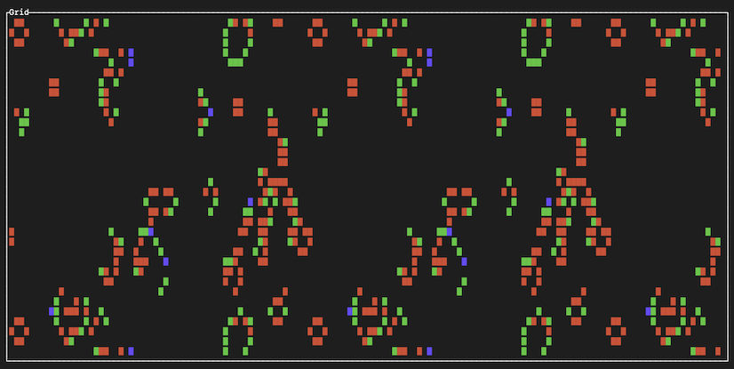

# seeker
[](https://github.com/kvark/seeker/actions/workflows/check.yaml)

Experimental playground for seeking the answer to [QLUE](https://kvark.github.io/seeker/) — the Question of Life, Universe, and Everything. Seeker uses evolutionary search over probabilistic cellular automata rules to discover interesting, survivable patterns.



## Modes

- **Play** — manually advance a cellular automaton step-by-step in a TUI
- **Find** — automatically search for interesting rule configurations via evolutionary algorithms

## Architecture

- `grid` — 2D wrapped-coordinate grid with `Option<Cell>` storage
- `sim` — simulation engine: probabilistic CA rules, grid advancement, statistics
- `lab` — evolutionary search: parallel experiments, fitness-proportional selection, mutation
- `analysis` — pattern classification (still lifes, oscillators, spaceships) via connected components
- `narrative` — event tracking (splits, merges, births, deaths) for measuring structural drama
- `gpu` — batch CA simulation on GPU via [blade-graphics](https://github.com/kvark/blade) compute shaders

## Features

The TUI and GPU modules are behind compile-time feature flags:

```sh
cargo run --features tui         # interactive TUI
cargo run --features gpu         # GPU-accelerated search
cargo run --features tui,gpu     # both
```

## Controls (TUI)

- Space: advance state
- Escape: exit
